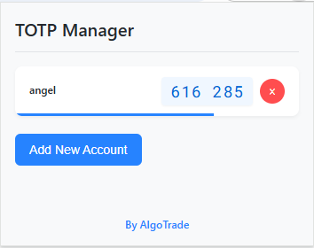

# TOTP Manager Chrome Extension

A simple, lightweight Chrome extension for managing Time-based One-Time Password (TOTP) codes for two-factor authentication.



## Features

- Store multiple TOTP secrets securely in your browser
- Generate standards-compliant TOTP codes compatible with Google Authenticator, Authy, and other 2FA apps
- Copy codes to clipboard with a single click
- Visual timer showing when codes will refresh
- Simple and intuitive interface

## Installation

### Manual Installation

1. Download or clone this repository to your computer
2. Open Chrome and navigate to `chrome://extensions/`
3. Enable "Developer mode" using the toggle in the top-right corner
4. Click "Load unpacked" and select the directory containing the extension files
5. The extension should now appear in your browser toolbar

## How to Use

1. Click on the TOTP Manager icon in your browser toolbar to open the popup
2. Click "Add New Account" to add a new TOTP secret
3. Enter an account name (e.g., "Gmail", "GitHub")
4. Enter the TOTP secret key (the Base32 encoded secret you get when setting up 2FA)
5. Click "Save" to store the account
6. To copy a TOTP code, simply click on it in the list
7. The blue progress bar indicates how much time is left before the code refreshes

## Privacy & Security

- All your TOTP secrets are stored securely in Chrome's sync storage
- Your secrets are synchronized across your devices where you're signed in to Chrome
- No data is sent to external servers
- The extension works completely offline after installation

## Technical Details

- Uses the industry-standard TOTP algorithm defined in [RFC 6238](https://tools.ietf.org/html/rfc6238)
- Compatible with all standard 2FA implementations
- Implements proper Base32 decoding and HMAC-SHA1 for code generation
- Written in vanilla JavaScript with no external dependencies

## Development

To set up the development environment:

1. Clone this repository
   ```
   git clone https://github.com/aijazsiddique/TOTP-Manager.git
   ```
2. Navigate to the project directory
   ```
   cd TOTP-Manager
   ```
3. Load the extension in Chrome using Developer mode as described in the installation section
4. Make your changes to the code
5. Refresh the extension in Chrome to test your changes

## Project Structure

```
totp-manager/
├── manifest.json        # Extension manifest
├── popup.html           # Main popup UI
├── popup.css            # Styles for the popup
├── popup.js             # Popup interaction logic
├── lib/
│   ├── jsotp.js         # TOTP implementation
│   └── totp.js          # TOTP wrapper
└── icons/
    ├── icon16.svg       # 16x16 icon
    ├── icon48.svg       # 48x48 icon
    └── icon128.svg      # 128x128 icon
```

## Contributing

Contributions are welcome! Please feel free to submit a Pull Request.

1. Fork the repository
2. Create your feature branch (`git checkout -b feature/amazing-feature`)
3. Commit your changes (`git commit -m 'Add some amazing feature'`)
4. Push to the branch (`git push origin feature/amazing-feature`)
5. Open a Pull Request

## License

This project is licensed under the MIT License - see the [LICENSE](LICENSE) file for details.

## Acknowledgments

- Developed by [AlgoTrade](https://github.com/aijazsiddique/AlgoTrade)
- Inspired by the need for a simple, lightweight TOTP manager
- Thanks to all contributors and users for their support and feedback

## Contact

If you have any questions, suggestions, or issues, please create an issue in this repository or contact the maintainer.

---

Made with ❤️ by [AlgoTrade](https://github.com/aijazsiddique/AlgoTrade)
